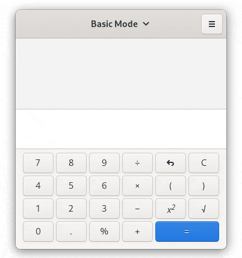

## What
An experiment with [Gtk Broadway](https://developer.gnome.org/gtk3/stable/gtk-broadway.html) and [gremlins.js](https://github.com/marmelab/gremlins.js/) to monkey test Gtk application.

## Setup
- python -m venv .env
- source .env/bin/activate
- pip install -r requirements.txt
- Make sure geckodriver is installed

## Run
-  python test.python gnome-calculator # or any other gtk application

